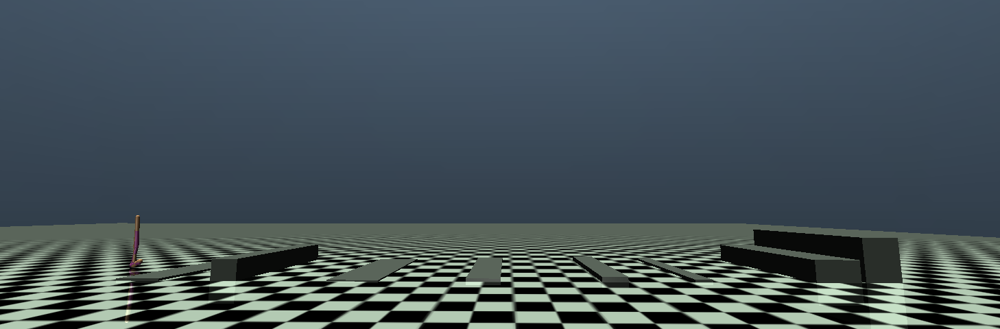

# Topics in Computer Graphics: Human Motion - Spring 2025

This repository contains the skeleton code for Assignment #1 of the SNU Human Motion course.  
It is based on the [Walker2d-v5](https://github.com/Farama-Foundation/Gymnasium) environment from OpenAI Gymnasium, and demonstrates training using PPO from [Stable-Baselines3](https://stable-baselines3.readthedocs.io/en/master/).

## Installation

We have tested this code on Ubuntu 22.04 and macOS M1.

```bash
# Create a virtual environment
cd {project_folder}
python3.10 -m venv venv
source ./venv/bin/activate

# Install dependencies
pip install "stable_baselines3[extra]>=2.0.0a9"
pip install "gymnasium[mujoco]"
```

## Training

Train a controller using Deep Reinforcement Learning (PPO).  
The trained model will be saved in the `checkpoints/` folder as a `.zip` file.

```bash
# Add --vel to train with a target velocity (for 1-2)
# Add --bump to train with bump terrain (for extra)
python learning.py (--bump) (--vel)
```

### Hyperparameters

You can modify hyperparameters for PPO in `learning.py` under `policy_kwargs` (Refer to the Stable-Baselines3 PPO documentation (https://stable-baselines3.readthedocs.io/en/master/modules/ppo.html) for available options).

## Rendering

Simulate the trained model.

```bash
# --vel: train with a target velocity (for 1-2)
# --bump: simulate on bump terrain (for extra)
# --model: path to the trained model
python rendering.py --model {model_path} (--bump) (--vel)
```

## Logging

Training logs are saved in the `logs/` directory. You can visualize them with TensorBoard:

```bash
tensorboard --logdir=logs
```

## Environment 

### Obstacle Information (Bump Environment)



The environment includes several bump obstacles defined in the XML. Their positions and sizes are listed below:

| Bump        | Position         | Size              |
|-------------|------------------|-------------------|
| Bump #1     | (2.0, 0.0, 0.0)  | (0.5, 2.0, 0.05)  |
| Bump #2     | (4.0, 0.0, 0.0)  | (0.3, 2.0, 0.5)   |
| Bump #3     | (7.0, 0.0, 0.0)  | (0.6, 2.0, 0.03)  |
| Bump #4     | (10.0, 0.0, 0.0) | (0.4, 2.0, 0.07)  |
| Bump #5     | (13.0, 0.0, 0.0) | (0.3, 2.0, 0.12)  |
| Bump #6     | (15.0, 0.0, 0.0) | (0.2, 2.0, 0.06)  |
| Bump #7     | (18.0, 0.0, 0.0) | (0.5, 2.0, 0.50)  |
| Bump #8     | (19.0, 0.0, 0.0) | (0.4, 2.0, 1.00)  |


### Customization

You can customize the Observation, Reward, and Termination Condition in `custom_walker2d.py`.  We recommend modifying the sections marked with `TODO`.

Note: Do not modify the XML file path or environment parameters in `__init__`. Test will be based on the default environment setup.


## Reference

- https://github.com/IntelligentMOtionlab/2023AdvancedGraphicsAssn04

